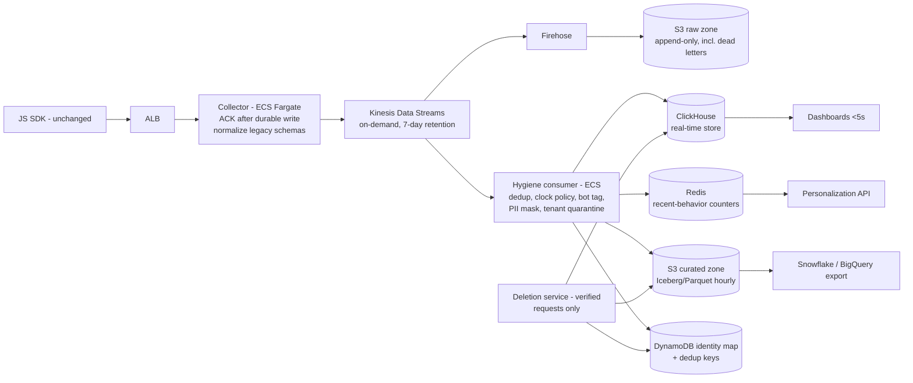

# Engineer 004 — Real-Time Analytics Pipeline

Brief version: 2026-07.
Fixture checksum (`shasum -a 256 fixtures/event_sample.jsonl`): `1aeb24b415009e89fcf8acb5a178410faf216dc17b16920d9849ecc8bbb24235` [Observed].

## Written answer

### 1. Architecture and technology choices

Design bias: boring, buffered, replayable. Two dedicated engineers cannot operate a Kafka + Flink + Druid estate; every component below is either already in the stack or a managed service. [Assumed] Team constraints as stated in the brief.



- **Collector (ECS Fargate behind ALB).** Terminates the *existing* SDK endpoints byte-for-byte — the fixture proves old payload shapes are live in the field (`evt-0009` uses `timestamp`/`page_path`/`ref` and type `pageview`), so normalization is a server-side mapping table, never an SDK change. ACKs only after a durable Kinesis write; on stream backpressure it spills to local disk and retries rather than 500ing, because we cannot assume every deployed SDK version retries correctly. [Observed] legacy fields, from the fixture via the attached detector output `findings.txt`.
- **Kinesis Data Streams (on-demand) over MSK/Kafka:** same durability and replay semantics with no broker operations; over SQS: we need ordered replay and multiple consumers; over "Firehose only": Firehose alone cannot feed a sub-5-second consumer. [Assumed] no existing Kafka expertise on the team.
- **S3 raw zone via Firehose.** Append-only record of everything received, including dead letters. This is the replay source, the reconciliation source of truth during migration, and the audit trail.
- **One hygiene consumer service** (ECS, enhanced fan-out) applies the fixture-informed rules in §Fixture below, then writes to the serving stores. Chosen over Managed Flink for v1: our transforms are per-event or small-window; a plain checkpointed consumer is debuggable by the whole team. Flink is the upgrade path if windowed sessionization grows.
- **ClickHouse for dashboards** over Redshift (concurrency and sub-second slice queries at this event volume), over Druid/Pinot (operational weight for a 12-engineer org), over Timestream (query flexibility for arbitrary segment filters like "viewed pricing 3x this week"). Managed ClickHouse on AWS is the default; self-managed EC2 only if the quote breaks the budget. **Redis** (already in stack) holds short-TTL recent-behavior counters for personalization triggers, written inline by the consumer. **Warehouse export** is hourly Parquet/Iceberg partitions in a curated S3 zone that Snowflake/BigQuery ingest natively — we never build a bespoke per-warehouse pusher.
- **Identity stitching:** `identify` events write anon→user edges to DynamoDB (last-write-wins in v1, conflicts logged). Queries join through the map at read time; we do not rewrite history on stitch, which keeps deletion tractable.
- **GDPR/CCPA as architecture:** deletion is a first-class service that accepts only verified, authenticated requests (see §Fixture on `evt-0017`), tombstones the identity map, issues ClickHouse deletes and curated-zone partition rewrites, and relies on a short raw-zone TTL so raw data ages out on its own. [Assumed] 90-day raw retention, inside the 30-day deletion SLA for serving stores because raw is access-restricted and auto-expiring; confirm with counsel.

### 2. Scale, reliability, migration

**Sizing.** 50M events/day [Assumed, given in brief] ≈ 580/s average [Estimated, arithmetic]; a 10x spike is ~5,800/s. Fixture events are ~230–260 bytes [Observed] (measure: `wc -c` per line of `event_sample.jsonl`); assume 1 KB enriched [Assumed] → spike ingest ≈ 6 MB/s. Kinesis on-demand streams scale to 200 MB/s ingest by default [Benchmarked, AWS public docs, verify at build time] — >30x headroom, so the scaling risks are the collector fleet (auto-scale on ALB queue depth, pre-scaled for known events like Black Friday) and ClickHouse insert throughput (batched inserts from the consumer, load-tested in Phase 1). Raw volume ≈ 50 GB/day ≈ 1.5 TB/month [Estimated].

**Cost.** Rough monthly estimate at steady state: ClickHouse $3–6K, ECS collector+consumer $1–2K, Kinesis+Firehose under $1K, S3+DynamoDB+Redis $1–2K → **$6–11K/month [Estimated]**, well under the $50K ceiling [Assumed, given in brief]. These are planning numbers, not quotes; Phase 1's parallel run produces observed costs before any commitment, and the 4x gap to the ceiling is the safety margin.

**Delivery guarantees, stated precisely.** At-least-once from SDK to raw zone (ACK after durable write; retries produce duplicates like `evt-0002` [Observed], deduplicated downstream by `(tenant_id, event_id)` over a 48h window). Effectively-once into ClickHouse/curated zone. Under overload, freshness degrades first (consumer lag grows), never durability; dashboards show a staleness indicator instead of silently showing partial data. Loss/duplication is *measured*, not assumed: synthetic canary events injected at the SDK edge for every tenant shard, reconciled end-to-end every 5 minutes [Assumed], plus continuous collector-vs-store count reconciliation.

**Migration without breakage.** The SDK and its endpoints never change; the cutover is entirely server-side and per-tenant.

- *Phase 0 (weeks 1–4):* new pipeline dark. Collector mirrors traffic: old pipeline unchanged, copy to Kinesis. Rollback = remove the mirror; zero customer impact.
- *Phase 1 (weeks 5–10):* parallel run. Nightly reconciliation compares per-tenant-per-hour counts old vs new and **classifies** deltas rather than diffing blindly — the new pipeline will legitimately count *lower* because it dedups retries (`evt-0002` [Observed]) and dead-letters unparseable lines (fixture line 21 [Observed]) that the old system may have double-counted or dropped differently. "Accuracy verified" is testable: 30 consecutive days [Assumed] with unexplained delta < 0.1% per tenant-day [Assumed], tightened if old-system noise allows.
- *Phase 2 (weeks 11–16, MVP):* dashboard reads move behind a per-tenant feature flag: internal tenants → ~5% friendly cohort → all. **Rollback trigger:** unexplained reconciliation delta > 0.5% or p95 event-to-dashboard latency > 5s for 15 minutes [Assumed] flips reads back instantly; old pipeline is still ingesting everything.
- *Phase 3 (months 5–6):* personalization triggers and warehouse exports migrate the same way; decommission old pipeline after 30 quiet days.

**MVP scope (3 months, 2 engineers):** collector, stream, raw zone, hygiene consumer, ClickHouse, one real-time dashboard, canaries + reconciliation harness. Explicitly excluded from MVP: automated warehouse export (manual hourly Parquet drops first), self-serve deletion portal (ops-assisted with the same verified workflow), ML bot detection (behavioral rules only), and any SDK work.

### 3. Fixture analysis (required)

Detector: `detect_anomalies.py` (attached, stdlib-only); full machine output in `findings.txt` / `findings.json`. It detects anomaly *classes*, not memorized ids, and has 9 unit tests (`test_detect_anomalies.py`). Of 25 non-empty lines: 24 parse, 1 is malformed. [Observed] — reproduce with the command in Artifact access.

| Anomaly class | Event ids [Observed] | Pipeline handling |
|---|---|---|
| Duplicate delivery (exact retry, same payload, later `received_at`) | `evt-0002` (lines 2, 5) | Dedup by `(tenant_id, event_id)`, 48h window; retry counted once |
| Client clock ahead of server (−47.19s) | `evt-0005` | `received_at` is the authoritative event time; client `ts` kept as attribute |
| Gross skew, exactly −3,900s (65 min) | `evt-0006` | Same policy; flagged for per-device skew monitoring |
| Implausible timestamp (year 2027) | `evt-0016` | Clamped out of time-ordering; raw preserved |
| Legacy SDK schema (`timestamp`, `page_path`, `ref`, type `pageview`) | `evt-0009` | Collector normalizes via mapping table; SDK untouched |
| Missing `tenant_id` | `evt-0011` | Quarantined; never guessed, never billed, alerting on rate |
| Machine-speed burst, 22ms max gap, bot referrer | `evt-0012`–`evt-0015` | Tagged `bot=true`; excluded from dashboards/personalization by default; raw kept |
| Malformed JSON (truncated line) | line 21 (`evt-0020` prefix) | Dead-letter store with parse error; alerting on rate — this class is where a "3% loss" hides |
| PII in properties (email, phone) | `evt-0007` | Masked in serving stores, original vaulted; included in deletion scope |
| In-band privacy request | `evt-0017` | Routed to compliance queue, **not** auto-executed (below) |
| Client-computed aggregate (`count_today: 3`) | `evt-0019` | Stored as claim only; segments derived server-side |
| Identity stitching (4 anon→user pairs incl. `anon-77a`→`u-1077`) | `evt-0003`, `evt-0008`, `evt-0022` + map | Anon-period events joined at read time; deletion for `u-1077` must also cover `evt-0006` |
All ids above [Observed] from `fixtures/event_sample.jsonl` via `detect_anomalies.py`; see `findings.txt`.

**Things I would not act on at face value:**

1. **`evt-0017` (GDPR `delete_all_data`).** It arrived through the unauthenticated analytics SDK — anyone who can run JavaScript on a page can forge one. Acting on it directly is a data-destruction vulnerability. It opens a compliance ticket; deletion executes only after verification through an authenticated channel. The stitching consequence is real, though: once verified for `u-1077`, deletion must include the anonymous-period event `evt-0006` reachable only via the `anon-77a` mapping.
2. **`evt-0019` (`count_today: 3`).** A client-computed counter, and the sample itself contradicts it: `anon-9f2` shows one observed `/pricing` page view (`evt-0001`) in this window. The "viewed pricing 3x" segment the brief asks for is computed server-side from raw events, never from client counters.
3. **`evt-0006` (−65 min, exactly).** A perfectly round 3,900s offset looks like a timezone/DST misconfiguration, not random drift. I will not "correct" it by guessing the zone; ordering uses `received_at` and the raw `ts` is preserved.
4. **The bot referrer string.** Referrers are spoofable and 4 events are far too few to build a blocklist. Tagging keys on behavior (sub-100ms gaps across distinct pages); the referrer is a secondary signal. Nothing is dropped at ingest.
5. **The sample size itself.** 1 duplicate in 25 lines is not a 4% duplicate rate; 4 bot events are not a 16% bot share. [Estimated] rates like these are measured during the Phase 1 parallel run, not extrapolated from a 25-line snapshot.

### 4. Trade-offs and risks

Optimizing for durability, replayability, and operability by a 2-person team; sacrificing minimal latency (target <5s, expected 1–3s [Estimated], not sub-second), single-region resilience (accepted at this budget), and streaming sophistication (no Flink-grade sessionization in v1). Biggest risks: ClickHouse is a new datastore for the team (mitigated by choosing managed, and by Redshift as the fallback if segment-query latency proves acceptable); dedup-store outage (fail open — duplicates pass through flagged, dashboards tolerate temporary dupes; billing/exports reconcile later — rather than fail closed and drop events); reconciliation blind spot where old and new are wrong identically (mitigated by canary events, which are ground truth independent of both). With more time/budget: multi-region ingest, Flink sessionization, ML bot scoring, and a self-serve privacy portal.

## Operating artifact

`detect_anomalies.py` — a stdlib-only, deterministic anomaly detector for the event stream (10 anomaly classes, generic rules, no fixture-specific ids) [Observed, count the detectors in the file], with `test_detect_anomalies.py` (9 unit tests [Observed], run them) and its committed output on the current fixture (`findings.txt`, `findings.json`). The same rule set is the specification for the hygiene consumer above. See Artifact access for links and run commands.

## Evidence log

| Claim | Tier | Check |
|---|---|---|
| Fixture contains the 12 anomaly rows tabled above | Tier 3 | Run command below; `findings.txt` / `findings.json` committed |
| Detector behaves as claimed on each class | Tier 3 | `python3 -m unittest -v` in the artifact folder, 9 tests |
| Skew values (−47.19s, −3,900s, ~+1 year) | Tier 3 | Computed by the script from fixture timestamps |
| Kinesis on-demand headroom at 6 MB/s spike | Tier 0 | [Benchmarked] against AWS public docs; re-verify at build |
| $6–11K/month cost estimate | Tier 0 | [Estimated] planning range; becomes observed in Phase 1 |
| <5s end-to-end latency | Tier 0 | [Estimated]; validated by canary timing in the parallel run |
Tier definitions per SCORING.md; rows without a committed artifact are labeled Tier 0 deliberately — [Estimated] planning numbers are claims until the parallel run measures them.

## Number source labels

Every number above carries `[Observed]`, `[Estimated]`, `[Benchmarked]`, or `[Assumed]` inline. Summary: fixture-derived values are Observed (reproducible via `detect_anomalies.py` and committed in `findings.json`); brief-supplied values (50M/day, $50K ceiling, team size, 10x spikes) are treated as Assumed inputs; AWS limits are Benchmarked against public docs pending build-time verification; all cost, latency, and threshold figures are Estimated or Assumed planning values that the Phase 1 parallel run converts to Observed before any cutover decision.

## AI usage disclosure

Claude Code (Anthropic's agentic coding tool) was used heavily and deliberately, in line with this challenge's premise: it explored the fixture, drafted the detector script, the unit tests, and this document, and ran the tests and your `validate_submission.py` pre-screen. Direction, review, and the final call on every design position are mine. [FILL IN BEFORE SUBMITTING — in your own words: what you personally changed or rejected from the draft, what you verified by hand (e.g., re-running the detector and tests yourself, spot-checking event ids against the raw fixture), and any position you overrode.] Known weak spots of the AI-assisted output: AWS pricing/limit figures were not fetched from live sources and are labeled accordingly; the detector's thresholds (0.5s burst gap, 30-min gross-skew line) are [Assumed] judgment calls that could misclassify edge traffic and would be tuned against real data.

## Failure handling (what breaks it)

Sustained load beyond the collector fleet's scaling speed (detected by ALB queue depth and 5xx rate; mitigated by pre-scaling for known events and disk spill); dedup-store outage (fail open, duplicates flagged downstream); schema drift beyond the known alias table (unknown-field events quarantined with alerting, since `evt-0009` proves drift happens); a silent bug making old and new pipelines wrong identically during reconciliation (canary events exist precisely to catch this); deletion-scope bugs where anonymous-period events escape a verified GDPR request (the identity map is the single source of deletion scope, and the `identity_map` section of `findings.json` [Observed] is the test template for it). Detection is built in: canaries, count reconciliation, dead-letter rate alarms, and staleness indicators rather than silent partial data.

## What stays human

Executing any data deletion (verification and approval of `evt-0017`-style requests, [Observed] in `findings.json`); each migration phase's go/no-go and any rollback override; changes to bot-classification rules, because they alter customer-visible metrics and billing; schema-normalization mapping changes; and any retroactive rewrite of the identity map. All are one-way doors or customer-trust decisions; automation prepares them, a person executes them.

## Artifact access

Public repo folder (no login): https://github.com/DDYRich72/UpToCode/tree/claude/beat-claude-positions-fc853x/beat-claude/engineer-004

Reproduce everything with:

```bash
git clone https://github.com/ericosiu/beat-claude
git clone -b claude/beat-claude-positions-fc853x https://github.com/DDYRich72/UpToCode
cd UpToCode/beat-claude/engineer-004
shasum -a 256 ../../../beat-claude/challenges/engineer-004/fixtures/event_sample.jsonl   # expect 1aeb24b4...
python3 detect_anomalies.py ../../../beat-claude/challenges/engineer-004/fixtures/event_sample.jsonl
python3 -m unittest -v
```

Python 3.10+ [Assumed] as the floor (developed on 3.11); no dependencies, no network, no credentials. Expected script output is committed as `findings.txt` and `findings.json`.
